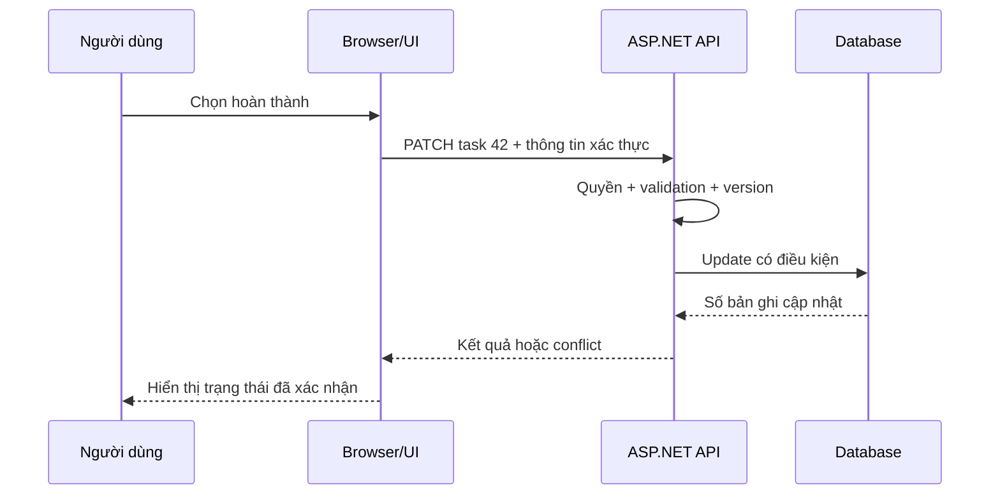

# 01 — FE/BE: từ thao tác người dùng đến dữ liệu

## Học cơ chế trước lab — bổ sung 2026-10-06

Giữ phần overview dưới để ôn; phần học nền chi tiết ở các bài sau:

- [Web01 — Browser, URL và một request HTTP](web/01_HTTP_BROWSER.md)
- [Web08 — API: invariant trước endpoint shape](web/08_API_CONTRACTS.md)

Mục tiêu: tự vẽ đường đi của một request, xác định nơi đặt validation và biết bằng chứng cần lấy khi UI báo lỗi. Học trước: biến, hàm và JSON. Không cần dựng microservices để học bài này.

## một thao tác, nhiều ranh giới

Giả sử người dùng đánh dấu task hoàn thành. Browser giữ trạng thái giao diện, gửi `PATCH /tasks/42`; backend đọc danh tính, kiểm tra quyền trên task 42, kiểm tra dữ liệu, ghi database rồi trả representation mới. UI chỉ hiển thị thành công sau khi chấp nhận kết quả hoặc có chiến lược optimistic update và rollback rõ.

Frontend chịu trách nhiệm tương tác, accessibility, trạng thái loading/error và hiển thị. Backend chịu trách nhiệm quy tắc được tin cậy: quyền, giới hạn, tính nhất quán và lưu trữ. Validation ở FE giúp phản hồi sớm; client có thể bị thay thế nên backend vẫn phải kiểm tra. SSR chạy trên server nhưng vẫn thuộc phần kiến trúc hiển thị; “frontend” không đồng nghĩa “chỉ có browser”.

## contract và vòng đời

Viết contract nhỏ trước code: `Task = {id:string, title:string, done:boolean, version:number}`; title dài 1–80 ký tự, version phải bằng bản đang lưu. PATCH thành công trả task mới; conflict trả 409; thiếu xác thực trả 401; không có quyền trả 403 hoặc 404 theo chính sách chống lộ tài nguyên. Không tự chọn status dựa trên câu chữ lỗi.

Một HTTP request có thể thất bại trước khi đến API, sau khi API nhận, hoặc sau khi database đã commit nhưng trước khi response về browser. Vì vậy timeout không chứng minh thao tác chưa xảy ra. Retry POST tạo đơn cần khóa idempotency gắn người dùng và payload; retry GET thường đơn giản hơn nhưng vẫn cần giới hạn số lần và backoff. Semantics phương thức/status tham khảo [HTTP RFC 9110](https://www.rfc-editor.org/rfc/rfc9110.html).

Phân biệt ba loại state: UI cục bộ (tab đang mở), server state (task đang lưu), và credentials (session/token). Copy server state sang nhiều component tạo nhiều bản có thể lệch nhau. Chọn một nơi quản lý và chính sách invalidation thay vì “refresh mọi thứ”.

## failure budget và ownership

Đặt deadline xuyên tầng: browser 5 giây, API có budget nhỏ hơn để còn thời gian trả lỗi; propagate cancellation đến I/O. Cancellation yêu cầu ngừng công việc, không rollback dữ liệu đã commit. Chọn invariant thay vì chỉ happy path: một request key không tạo hai đơn; một người không đọc task của người khác; một update không âm thầm ghi đè version mới.

Log cần trace/request ID, route, status và thời gian; không cần token hoặc nội dung cá nhân. Đo p95/p99, error rate, queue length thay vì chỉ trung bình. Nếu UI chậm nhưng API 30 ms, điều tra network/render; nếu API 2 s nhưng DB 10 ms, xem queue, serialization hoặc dependency ngoài. Không suy ra bottleneck từ một số đo đơn lẻ.

## sự thật ở đâu?

Database là nguồn dữ liệu nghiệp vụ theo thiết kế, nhưng cache, replica và offline UI có thể quan sát phiên bản khác nhau. Quyết định consistency theo use case: badge chưa cập nhật vài giây khác với tồn kho bán hàng. Monolith nhỏ dễ debug hơn distributed system; chỉ tách service khi có ranh giới và nhu cầu vận hành rõ.

## Bài thực hành và tự kiểm tra

Vẽ flow trên giấy với lỗi response bị mất sau commit. Sau đó làm [integration lab](labs/integration/README.md), ghi status/payload ở từng tầng.

1. Vì sao ẩn nút Delete không đủ để bảo vệ endpoint?
2. Timeout có những kết cục nào đối với dữ liệu?
3. SSR có cần kiểm tra quyền ở API nữa không?
4. Khi nào rollback optimistic update có thể ghi đè thao tác mới hơn?

Hoàn thành khi chỉ ra được trust boundary, contract, invariant và vị trí thu bằng chứng cho cả success lẫn failure. Đọc tiếp [02](02_FRONTEND_DEEP_DIVE_AND_BUGS.md) và [03](03_BACKEND_DEEP_DIVE_AND_BUGS.md).

Nguồn bổ sung: [Next.js server/client](https://nextjs.org/docs/app/getting-started/server-and-client-components), [OWASP API risks](https://api-security.owasp.org/editions/2023/en/0x11-t10/). Phiên bản và phạm vi nguồn ở [REFERENCES](REFERENCES.md).

## Debug section — bài kiểm tra giải thích được cơ chế

- **SYMPTOM:** mô tả outcome quan sát của [INT-20](labs/integration/INT-20.md); không dùng tên bug làm triệu chứng.
- **EVIDENCE:** dùng mục Evidence/Reproduction trong lab; ghi build/version, raw state/owner và timeline.
- **POSSIBLE CAUSES:** Client deadline sớm hơn commit/response nên outcome là chưa biết. Chỉ xem đây là một giả thuyết; thêm một nguyên nhân cạnh tranh từ bài nền.
- **DISTINGUISHING TEST:** replay trigger với thứ tự actors được điều khiển; so raw input/output với state sau từng boundary, giữ một yếu tố thay đổi mỗi lượt.
- **ROOT CAUSE:** chỉ kết luận khi thấy operation đầu phá invariant: Timeout không được giả định operation chưa commit; outcome được reconcile.
- **FIX:** thực hiện Fix của lab sau evidence; giữ contract/feature và scope thay đổi.
- **WRONG FIX:** Khẳng định chưa tạo sau timeout rồi submit intent mới.
- **REGRESSION TEST:** replay trigger gốc và một case biên/đảo thứ tự, kiểm cleanup/error paths; báo chạy thật khác model/review tĩnh.

[Bài nền liên quan](web/01_HTTP_BROWSER.md) · [Debug method](debug/01_EVIDENCE_METHOD.md) · [Validation](VALIDATION.md).
