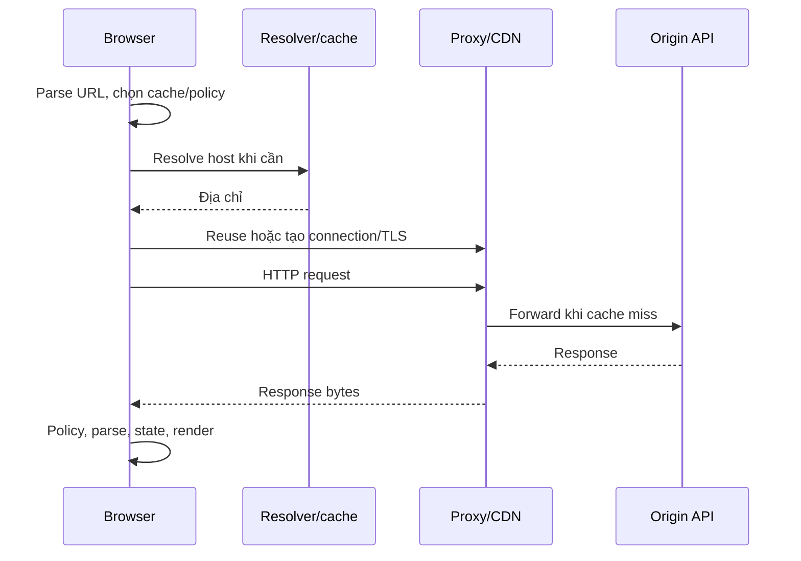

# Outline — Computer ↔ network ↔ browser: một URL đi đâu?

Mức của claim minh họa: **UNVERIFIED**. Không phải mức chứng nhận toàn bài.

## 1. Hook

DNS failure xảy ra trước HTTP status; TCP timeout khác TLS trust failure; proxy 502/504 khác endpoint 400; CORS có thể chặn đọc response dù side effect đã tới server. Cookie bị chặn tạo anonymous request; lỗi ấy không tự là JWT signature. Retry sau timeout có thể duplicate vì response mất sau commit.

Đặt câu hỏi: cơ chế trong [Computer ↔ network ↔ browser: một URL đi đâu?](../../web/01_HTTP_BROWSER.md) giải thích failure này bằng invariant nào?

## 2. Mô hình trong 60 giây

```text
representation -> actor/control flow -> ownership/lifetime -> invariant -> evidence
```



Sơ đồ khái niệm, không packet capture đã đo. HTTP/1.1 dùng persistent connections theo rules; HTTP/2 nhiều stream trên một connection. HTTP/3 dùng QUIC thay TCP. DNS/TLS có thể được reuse; không đo mỗi request bằng công thức một lookup+một handshake cố định.

## 3. Demo chạy thật

Claim có phạm vi: HTTP request ≠ TCP connection; CORS ≠ authorization; cookie ≠ session; URL ≠ resource memory. Đích protocol phải đúng, TLS trust đúng, credentials chỉ tới boundary cần nó, cache không trộn principals. Server kiểm authority trên mọi protected operation, kể cả request không có Origin hoặc từ client khác browser.

**BLOCKED — chưa có demo thực thi riêng cho claim này.** Không có output để trích; không dùng kết quả của bài khác thay thế. Chưa sẵn sàng xuất bản phần demo. Xem [bài nguồn](../../web/01_HTTP_BROWSER.md) và [matrix](../../THEORY_COVERAGE_MATRIX.md).

## 4. Cách nó hỏng và cách phát hiện

DNS failure xảy ra trước HTTP status; TCP timeout khác TLS trust failure; proxy 502/504 khác endpoint 400; CORS có thể chặn đọc response dù side effect đã tới server. Cookie bị chặn tạo anonymous request; lỗi ấy không tự là JWT signature. Retry sau timeout có thể duplicate vì response mất sau commit.

Network panel có request/status/timing/initiator; Security/cookie blocked reason giải thích browser policy. Gắn trace ID để nối proxy/API/DB, nhìn stage cuối observed thay vì đoán từ message browser. DNS/connect timing không luôn xuất hiện trên reused connection. So direct synthetic request với browser giúp phân biệt browser policy và server authority; không bypass auth để thí nghiệm.

## 5. Giới hạn trung thực

Source/pseudocode review only; no topic-specific executable record. Demo remains BLOCKED.

Outline này trích nội dung hiện có; không bổ sung bảo đảm về target chưa đo. Chỉ công bố demo khi mức/evidence phù hợp.

## 6. Nguồn và câu hỏi tự kiểm tra

[RFC 9110 architecture/URI](https://www.rfc-editor.org/rfc/rfc9110.html), [RFC 9114 HTTP/3](https://www.rfc-editor.org/rfc/rfc9114.html), [MDN URL](https://developer.mozilla.org/en-US/docs/Learn_web_development/Howto/Web_mechanics/What_is_a_URL), [MDN HTTP overview](https://developer.mozilla.org/en-US/docs/Web/HTTP/Guides/Overview), [Chromium multi-process architecture](https://www.chromium.org/developers/design-documents/multi-process-architecture/). Chromium mô tả một implementation, không chuẩn cho mọi browser.

1. Ba request HTTP/2 cần ba TCP connections không? Đáp án: có thể chung connection với nhiều streams.
2. Cùng host khác port có cùng origin không? Đáp án: không.
3. Cache hit có chứng minh controller chạy? Đáp án: không, cần origin trace.
4. Cookie username có tự authenticated? Đáp án: không, server phải validate credential/context.
5. Timeout có chứng minh DB rollback? Đáp án: không; theo dõi intent/outcome.

[Index](../../00_INDEX.md) · [Content](../README.md).
