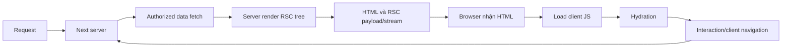

# Outline — Next.js: build, server, browser và boundary

Mức của claim minh họa: **UNVERIFIED**. Không phải mức chứng nhận toàn bài.

## 1. Hook

Date.now/random/locale render khác gây hydration mismatch; window ở server module lỗi; imported server secret module vào client graph lộ bundle; cached personalized output trộn user; invalidate client cache nhưng server Data Cache cũ; layout subscription không đổi theo params. Root fix chọn đúng execution boundary/deterministic input/cache owner, không suppress mọi warning.

Đặt câu hỏi: cơ chế trong [Next.js: build, server, browser và boundary](../../web/05_NEXT_EXECUTION.md) giải thích failure này bằng invariant nào?

## 2. Mô hình trong 60 giây

```text
representation -> actor/control flow -> ownership/lifetime -> invariant -> evidence
```



Sơ đồ mô hình, chưa chạy server. Client navigation có prefetch/payload transition rồi reconciliation, không luôn reload toàn document. Initial render client phải tương thích HTML, dùng cùng deterministic input/format. Browser API ở module/render có thể bị evaluate server và ném lỗi trước hydrate.

## 3. Demo chạy thật

Claim có phạm vi: Không secret/private authority đi client graph/payload. Serialized props chỉ chứa permitted values. First client render tương thích initial HTML; mutation được authorize tại server boundary. Cache key/policy không trộn tenant/user; invalidation tác động đúng layer. Route lifecycle được kiểm trước giả unmount của subscription.

**BLOCKED — chưa có demo thực thi riêng cho claim này.** Không có output để trích; không dùng kết quả của bài khác thay thế. Chưa sẵn sàng xuất bản phần demo. Xem [bài nguồn](../../web/05_NEXT_EXECUTION.md) và [matrix](../../THEORY_COVERAGE_MATRIX.md).

## 4. Cách nó hỏng và cách phát hiện

Date.now/random/locale render khác gây hydration mismatch; window ở server module lỗi; imported server secret module vào client graph lộ bundle; cached personalized output trộn user; invalidate client cache nhưng server Data Cache cũ; layout subscription không đổi theo params. Root fix chọn đúng execution boundary/deterministic input/cache owner, không suppress mọi warning.

So server logs với browser Console để xác định runtime. Inspect initial HTML/client first input/RSC data, build IDs và route lifetime. Test fresh initial request, client navigation, back/forward, two users và mutation invalidation. Giữ timestamp fixture constant để bác bỏ nondeterminism; inspect response data version để tách stale server/cache UI.

## 5. Giới hạn trung thực

Source/pseudocode review only; no topic-specific executable record. Demo remains BLOCKED.

Outline này trích nội dung hiện có; không bổ sung bảo đảm về target chưa đo. Chỉ công bố demo khi mức/evidence phù hợp.

## 6. Nguồn và câu hỏi tự kiểm tra

[Next15 server/client components](https://nextjs.org/docs/15/app/getting-started/server-and-client-components), [Next15 release/defaults](https://nextjs.org/blog/next-15), [Next15 caching guide](https://nextjs.org/docs/15/app/guides/caching), [Next15 layouts/pages](https://nextjs.org/docs/15/app/getting-started/layouts-and-pages), [Next15 environment variables](https://nextjs.org/docs/15/app/guides/environment-variables). Đường docs15 cũ fetching/rendering đã fetch lỗi; không cite chúng làm evidence. [REFERENCES](../../web/../REFERENCES.md) ghi ngày/giới hạn.

1. Client Component có thể tạo HTML server không? Đáp án: có initial prerender.
2. RSC payload có phải DOM tree trong RAM server gửi thẳng? Đáp án: serialized protocol output.
3. Layout có luôn unmount khi page đổi? Đáp án: không.
4. Streaming có giữ status đổi tùy ý sau headers gửi không? Đáp án: không, response đã start hạn chế outcome mapping.
5. Next15 no-cache defaults có nghĩa mọi cache biến mất? Đáp án: không.
6. Secret không public prefix nhưng qua props có private không? Đáp án: không.

[Index](../../00_INDEX.md) · [Content](../README.md).
