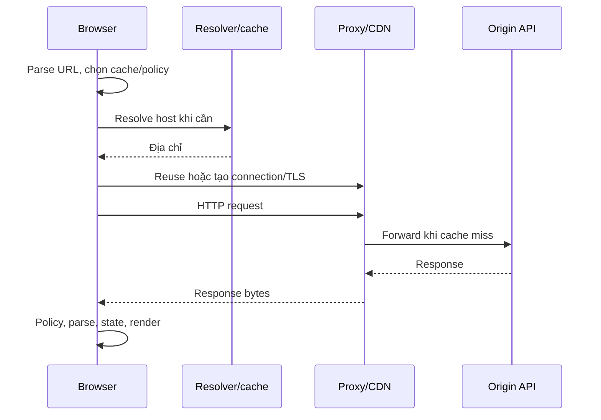

# Computer ↔ network ↔ browser: một URL đi đâu?

Phạm vi: browser phổ biến, HTTP/1.1 và HTTP/2 trên TCP/TLS; HTTP/3 trên QUIC được phân biệt. Browser implementation có thể đổi số process/thread.

## 1. Mục tiêu học

Vẽ đường đi từ URL tới representation hiển thị và gắn DNS, connection, HTTP message, browser policy vào đúng boundary. Phân biệt IP/port với identity ứng dụng, cookie với session, URL với object memory.

## 2. Kiến thức tiên quyết

Biết process là một chương trình đang thực thi và bytes là dữ liệu trao đổi. Kiến thức language/UI sẽ học sau; [HTTP semantics](12_HTTP_SEMANTICS.md) mở rộng message behavior.

## 3. Vấn đề mà cơ chế này giải quyết

Máy ở các vị trí khác nhau phải tìm nhau, truyền bytes và thống nhất ý nghĩa. Browser còn cách ly websites và quản lý UI; một request có thể không tới origin vì cache hoặc proxy. Mỗi tầng tồn tại để giải quyết một vấn đề khác: naming, routing, reliable transport, secure channel, semantics và presentation.

## 4. Khái niệm

URL định danh cách truy cập: scheme, host, port, path, query, fragment. `https://api.example.test:8443/tasks?limit=5#top`: request target thường chứa path/query; fragment xử lý client, không gửi thành request target. Origin là tuple scheme/host/port; origin không đơn giản là hostname. URL là identifier, không pointer tới một object trong RAM; server có thể tính representation mới mỗi request.

## 5. Thành phần bên trong

Browser thường có process quản lý UI, renderer(s), networking và GPU/services; tab không có quan hệ một-một cố định với process, site isolation và workers làm graph phức tạp hơn. Process có memory/resource context; thread là execution context; renderer main thread thực hiện nhiều JS/DOM work, workers có agent riêng. Không suy mỗi fetch tạo một thread JS.

DNS resolver tìm records/address; IP giúp định tuyến packet tới host/interface; port chọn endpoint transport trong host. TCP tạo byte stream có ordering/retransmission; application vẫn cần framing message. TLS trên stream tạo protected channel và xác minh server theo certificate/trust policy; không tự chứng minh quyền user trên task.

## 6. Data representation

HTTP request mang method/target/fields/content; response mang status/fields/content. Header là metadata protocol, body chứa representation/payload; cookie truyền qua `Set-Cookie`/`Cookie`, không tự nằm JSON body. Network buffer khác DOM/JS object sau parse; bytes chưa là DTO.

Proxy forward đại diện phía client; reverse proxy đứng trước origins, có thể terminate TLS/routing/limits. CDN phân phối edge có caches; API trace vắng có thể vì edge trả response. Mỗi hop có connection và deadline riêng, không một socket xuyên tất cả tầng.

## 7. Control flow



Sơ đồ khái niệm, không packet capture đã đo. HTTP/1.1 dùng persistent connections theo rules; HTTP/2 nhiều stream trên một connection. HTTP/3 dùng QUIC thay TCP. DNS/TLS có thể được reuse; không đo mỗi request bằng công thức một lookup+một handshake cố định.

## 8. Lifetime / ownership / state

Connection pool do browser/network service quản lý, request do actor gọi fetch/navigation sở hữu; chúng có lifetime khác nhau. Abort request không có nghĩa mọi stream/socket đóng. Cookie store có domain/path/expiry/policy; session store server gắn identifier với state/quyền. Cookie cũng có thể mang token hoặc preferences; session có thể dùng transport khác.

Cache entry giữ representation/metadata riêng; URL giống không đủ nếu headers, user/tenant hoặc content negotiation khác. Browser origin policy quyết định script được access gì; server authorization quyết định ai được thao tác resource.

## 9. Invariants

HTTP request ≠ TCP connection; CORS ≠ authorization; cookie ≠ session; URL ≠ resource memory. Đích protocol phải đúng, TLS trust đúng, credentials chỉ tới boundary cần nó, cache không trộn principals. Server kiểm authority trên mọi protected operation, kể cả request không có Origin hoặc từ client khác browser.

## 10. Ví dụ tối thiểu

Request minh họa HTTP/1.1, dùng hostname giả, không lệnh gọi server:

```http
GET /tasks?limit=5 HTTP/1.1
Host: api.example.test
Accept: application/json
```

Response minh họa:

```http
HTTP/1.1 200 OK
Content-Type: application/json
Cache-Control: private, no-store

{"items":[]}
```

Payload rỗng có nghĩa success không có items theo contract; connection vẫn có thể tồn tại cho request tiếp. Đây không phải kết quả một server đã chạy.

## 11. Failure modes

DNS failure xảy ra trước HTTP status; TCP timeout khác TLS trust failure; proxy 502/504 khác endpoint 400; CORS có thể chặn đọc response dù side effect đã tới server. Cookie bị chặn tạo anonymous request; lỗi ấy không tự là JWT signature. Retry sau timeout có thể duplicate vì response mất sau commit.

## 12. Debug / observability

Network panel có request/status/timing/initiator; Security/cookie blocked reason giải thích browser policy. Gắn trace ID để nối proxy/API/DB, nhìn stage cuối observed thay vì đoán từ message browser. DNS/connect timing không luôn xuất hiện trên reused connection. So direct synthetic request với browser giúp phân biệt browser policy và server authority; không bypass auth để thí nghiệm.

## 13. Liên hệ với bug/lab hiện có

[INT-11](../labs/integration/INT-11.md) giữ invariant credential transport; [INT-13](../labs/integration/INT-13.md) phân biệt preflight với auth; [INT-20](../labs/integration/INT-20.md) cho unknown outcome sau timeout; [FE-18](../labs/frontend/FE-18.md) cho CORS/authorization.

## 14. Sai lầm thường gặp

Không kết luận server chưa chạy chỉ vì browser báo network error. TLS terminate tại proxy không tự mã hóa hop sau nếu chưa cấu hình. Keep-alive transport không giữ login identity. Browser multi-process không cho JS trên cùng agent chạy hai jobs đồng thời.

## 15. Câu hỏi tự kiểm tra

1. Ba request HTTP/2 cần ba TCP connections không? Đáp án: có thể chung connection với nhiều streams.
2. Cùng host khác port có cùng origin không? Đáp án: không.
3. Cache hit có chứng minh controller chạy? Đáp án: không, cần origin trace.
4. Cookie username có tự authenticated? Đáp án: không, server phải validate credential/context.
5. Timeout có chứng minh DB rollback? Đáp án: không; theo dõi intent/outcome.

## 16. Nguồn

[RFC 9110 architecture/URI](https://www.rfc-editor.org/rfc/rfc9110.html), [RFC 9114 HTTP/3](https://www.rfc-editor.org/rfc/rfc9114.html), [MDN URL](https://developer.mozilla.org/en-US/docs/Learn_web_development/Howto/Web_mechanics/What_is_a_URL), [MDN HTTP overview](https://developer.mozilla.org/en-US/docs/Web/HTTP/Guides/Overview), [Chromium multi-process architecture](https://www.chromium.org/developers/design-documents/multi-process-architecture/). Chromium mô tả một implementation, không chuẩn cho mọi browser.

[Index](../00_INDEX.md) · [Coverage](../THEORY_COVERAGE_MATRIX.md).
