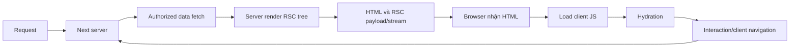

# Next.js: build, server, browser và boundary

Phạm vi: **Next.js 15 App Router**, React19 mental model; không dùng Cache Components/use-cache của các major khác làm mặc định. Đây là curriculum version, không upgrade project.

## 1. Mục tiêu học

Vẽ initial request và client navigation với HTML/RSC payload/hydration, xác định nơi chạy từng đoạn code, secret boundary và cache layer/invalidation. Phân biệt RSC với SSR, Client Component với browser-only.

## 2. Kiến thức tiên quyết

[React](04_REACT_MENTAL_MODEL.md), [HTTP/cache](12_HTTP_SEMANTICS.md), [browser](13_BROWSER_INTERNALS.md). Serialization và module graphs phải rõ trước truyền props server/client.

## 3. Vấn đề mà cơ chế này giải quyết

Web cần HTML sớm, dữ liệu từ server và tương tác browser mà không gửi mọi code/dependency ra client. Next tổ chức routes/rendering/build và delivery graph; boundaries quyết định data/code được phân phối và lifecycle. Cùng source có thể chạy ở nhiều pha, nên environment assumptions cần explicit.

## 4. Khái niệm

Build time tạo bundles/prerendered outputs theo route/config; server runtime xử lý request/data/render; browser runtime hydrate và xử lý interaction. Route xác định page/handler, layout là shared UI có preservation riêng. Server Component chạy trên server/build theo route rendering, không có client state/effect handlers; Client Component nằm client graph và cho interactions.

SSR tạo HTML cho initial view; RSC tạo payload biểu diễn rendered server tree và client component references/data. RSC không bằng HTML. `'use client'` chọn module boundary/transitive imports của client graph, không bảo đảm component chỉ render browser: initial HTML có thể prerender server.

## 5. Thành phần bên trong

Server renderer đọc authorized data, tạo RSC payload; HTML renderer dùng tree cùng client component instructions để tạo initial HTML; browser nhận HTML, payload và JS client rồi hydrate interactive parts. Suspense/streaming cho shell và chunks sẵn tới trước phần chậm; không biến mọi slow dependency thành parallel hoặc sửa waterfalls tự động.

Route layouts giữ state qua navigation phù hợp tree; templates/page thay identity theo framework route rules. Route Handler là endpoint HTTP riêng. Server Action/function entry từ client vẫn là server trust boundary phải auth/validate; không dựa nút hidden hoặc endpoint khó đoán.

## 6. Data representation

Payload chứa serialized props và references tới client modules, không raw server heap/repository/DB connection. Framework serialization không chỉ JSON stringify, có supported types và restrictions; ordinary function/event handler không tùy ý truyền như prop server→client. Secrets không được đưa vào serialized props/HTML/errors dù module ở server.

Cache layers giữ đối tượng khác nhau: request memoization tránh work lặp trong render phù hợp; Data Cache giữ cached fetch data; Full Route Cache giữ rendered outputs cho eligible routes; Router Cache ở browser giữ segments/payload theo rules; HTTP cache ngoài framework vẫn riêng.

## 7. Control flow



Sơ đồ mô hình, chưa chạy server. Client navigation có prefetch/payload transition rồi reconciliation, không luôn reload toàn document. Initial render client phải tương thích HTML, dùng cùng deterministic input/format. Browser API ở module/render có thể bị evaluate server và ném lỗi trước hydrate.

## 8. Lifetime / ownership / state

Request-scoped credentials/data không được cache chung cho users khác. Layout owner có thể sống qua pages, subscriptions phải theo params/current user và cleanup của owner ấy. Cache entry lifetime theo policy, route render lifetime khác browser state.

**Next15 defaults cần tách:** server fetch và GET Route Handlers không cached mặc định theo release guidance; có thể opt in. Page segments Router Cache có staleTime0 cho forward navigation, nhưng shared layouts và back/forward behavior vẫn có preservation/cache. Không suy mọi cache tắt. Revalidate data/tag/path và router refresh tác động các layers khác nhau, chọn API theo docs15/config thật.

## 9. Invariants

Không secret/private authority đi client graph/payload. Serialized props chỉ chứa permitted values. First client render tương thích initial HTML; mutation được authorize tại server boundary. Cache key/policy không trộn tenant/user; invalidation tác động đúng layer. Route lifecycle được kiểm trước giả unmount của subscription.

## 10. Ví dụ tối thiểu

Context fragment Next15, không app độc lập:

```jsx
// app/page.jsx — Server Component
import Counter from './Counter';
export default async function Page() {
  const dto = await readAuthorizedSummary(); // dependency ứng dụng
  return <Counter initial={dto.count} />;
}
// app/Counter.jsx — file riêng
'use client';
import { useState } from 'react';
export default function Counter({ initial }) {
  const [n, setN] = useState(initial);
  return <button onClick={() => setN(v => v + 1)}>{n}</button>;
}
```

Chỉ count qua boundary, không connection/token. Initial count giống server/client; update prop sau navigation cần semantics state riêng, useState initializer không tự resync mọi prop.

## 11. Failure modes

Date.now/random/locale render khác gây hydration mismatch; window ở server module lỗi; imported server secret module vào client graph lộ bundle; cached personalized output trộn user; invalidate client cache nhưng server Data Cache cũ; layout subscription không đổi theo params. Root fix chọn đúng execution boundary/deterministic input/cache owner, không suppress mọi warning.

## 12. Debug / observability

So server logs với browser Console để xác định runtime. Inspect initial HTML/client first input/RSC data, build IDs và route lifetime. Test fresh initial request, client navigation, back/forward, two users và mutation invalidation. Giữ timestamp fixture constant để bác bỏ nondeterminism; inspect response data version để tách stale server/cache UI.

## 13. Liên hệ với bug/lab hiện có

[FE-12](../labs/frontend/FE-12.md) hydrate consistency; [FE-13](../labs/frontend/FE-13.md) browser API; [FE-14](../labs/frontend/FE-14.md) client graph; [FE-16](../labs/frontend/FE-16.md) cache invalidation; [FE-20](../labs/frontend/FE-20.md) secret boundary. Không đổi lab docs current thành semantics15 nếu chưa đọc fixture.

## 14. Sai lầm thường gặp

Không đồng nhất `'use client'` với không SSR. Env var không private nếu được bundle/serialize; NEXT_PUBLIC variables dành phân phối client theo build rules. Router refresh không universal cache purge. HTTP GET idempotency khác framework caching defaults. Server render auth không bỏ authorization endpoint/actions.

## 15. Câu hỏi tự kiểm tra

1. Client Component có thể tạo HTML server không? Đáp án: có initial prerender.
2. RSC payload có phải DOM tree trong RAM server gửi thẳng? Đáp án: serialized protocol output.
3. Layout có luôn unmount khi page đổi? Đáp án: không.
4. Streaming có giữ status đổi tùy ý sau headers gửi không? Đáp án: không, response đã start hạn chế outcome mapping.
5. Next15 no-cache defaults có nghĩa mọi cache biến mất? Đáp án: không.
6. Secret không public prefix nhưng qua props có private không? Đáp án: không.

## 16. Nguồn

[Next15 server/client components](https://nextjs.org/docs/15/app/getting-started/server-and-client-components), [Next15 release/defaults](https://nextjs.org/blog/next-15), [Next15 caching guide](https://nextjs.org/docs/15/app/guides/caching), [Next15 layouts/pages](https://nextjs.org/docs/15/app/getting-started/layouts-and-pages), [Next15 environment variables](https://nextjs.org/docs/15/app/guides/environment-variables). Đường docs15 cũ fetching/rendering đã fetch lỗi; không cite chúng làm evidence. [REFERENCES](../REFERENCES.md) ghi ngày/giới hạn.

[Index](../00_INDEX.md) · [Coverage](../THEORY_COVERAGE_MATRIX.md).
